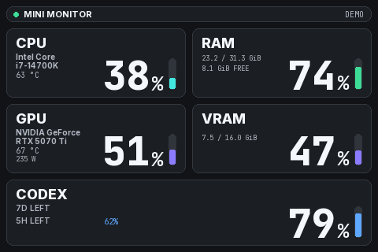

# Mini Monitor

Mini Monitor is an independent, unofficial GPL-3.0-or-later Windows dashboard, not an OpenAI product. It supports a 3.5-inch USB serial display and an optional desktop overlay. Five cards show CPU, RAM, GPU, VRAM and Codex account limits in 480×320 landscape (2+2+1) or 320×480 portrait orientation. Each card has a right-side gauge that fills upward; waveform graphs and duplicate bottom bars are omitted for readability.

[한국어 설치·사용 안내](README_KO.md) · [Releases](https://github.com/contentriumkorea/mini-monitor/releases) · [Source offer](SOURCE-OFFER.md) · [Test results](TEST_RESULTS.md)

AI data uses Codex account sign-in only. Local session scanning, API organization usage and foreground-app activity collection are no longer offered. Credit balance is shown separately from quota remaining; unavailable balances are never inferred as zero. Setup uses a neutral black/gray palette; the small display emphasizes VRAM and omits status badge text.

The optional draggable taskbar bar shows CPU, RAM, GPU, VRAM and Codex as PNG icons plus percentages, with a fully transparent background and opaque readouts. Hardware readings require monitoring to be started; Codex uses the same account snapshot as setup. It is an independent overlay, not an Explorer/taskbar modification.

Taskbar settings let you select individual metrics (at least one), using icons, text labels, or both. Preferences persist across restarts. Placement avoids the primary taskbar notification area when restoring, dragging, or resizing the bar.

The horizontal position slider covers the available range on the current monitor. Arrow buttons move by one pixel; reset restores the default horizontal position while preserving the vertical position. Position changes save immediately, independently of metric selection Apply/Cancel, and do not turn on a hidden bar.

Setup opens at approximately 960×720 with compact device and account controls. Updates open separately; CLI selection and installation help remain available under collapsed connection troubleshooting. Internal scrolling remains a fallback for small screens and high display scaling.

Download the stable `Mini-Monitor.zip` release and keep its entire `Mini-Monitor` folder together. Run `Mini-Monitor.exe` to open setup without starting serial transmission. `Mini-Monitor-CLI.exe` provides read-only diagnostics and synthetic preview generation. The official [Codex CLI](https://learn.chatgpt.com/docs/codex/cli) must be installed separately; Mini Monitor neither bundles it nor copies your default Codex authentication. The Windows executable is not Authenticode-signed; the signed update metadata is a separate integrity mechanism.

Only devices matching USB VID `1A86`, PID `5722` and serial `USB35INCHIPSV2` may receive serial output. An older AI-Mini-Monitor build or the withdrawn 0.2.0 build needs one manual baseline upgrade to 0.2.1; 0.2.0 cannot discover this update in-app. Thereafter, Mini Monitor checks for stable updates at startup and periodically while running, with a 24-hour network-check gate; the setup button can check on demand. An update notice never downloads or installs a release by itself: applying it requires an explicit click. Physical USB output and live account login require separate testing on your own hardware/account.
