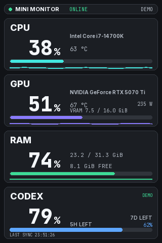

# Mini Monitor

Mini Monitor는 OpenAI의 공식 제품이 아닌 독립 오픈소스 프로그램입니다. Windows PC의 CPU·GPU·RAM과 공식 Codex CLI를 통해 얻은 계정 한도를 3.5인치 USB 화면 또는 선택적 PC 상태창에 보여 줍니다. 가로 480×320과 세로 320×480 화면을 지원합니다. 실제 장치에 데이터를 보내는 동작은 사용자가 `모니터 시작`을 누른 뒤에만 시작됩니다.




위 이미지는 합성 수치를 사용한 미리보기입니다. 실계정 잔여 한도나 실제 USB 화면 사진이 아닙니다.

## 설치 및 첫 실행

1. [Releases](https://github.com/contentriumkorea/mini-monitor/releases)에서 최신 stable `Mini-Monitor.zip`을 받습니다. `Mini-Monitor` 폴더 전체를 원하는 위치에 압축 해제하세요. EXE만 따로 옮기면 실행되지 않습니다.
2. `Mini-Monitor.exe`를 실행합니다. 처음에는 설정창만 열리며 직렬 화면에 데이터를 전송하지 않습니다. Windows가 미서명 앱 경고를 표시할 수 있으니, 게시처와 [해시](https://github.com/contentriumkorea/mini-monitor/releases)를 직접 확인한 뒤 실행 여부를 결정하세요. 이 EXE는 Authenticode 코드 서명이 없습니다. 업데이트 메타데이터의 Ed25519 서명은 EXE 코드 서명과 다릅니다.
3. Codex 한도를 보려면 공식 [Codex CLI 설치 안내](https://learn.chatgpt.com/docs/codex/cli)의 Windows 탭을 따라 CLI를 별도 설치하고, 설정창에서 `Codex 계정 · 공식 로그인`을 고릅니다. `ChatGPT로 로그인`은 웹 브라우저 인증을 엽니다. Mini Monitor는 기본 Codex 홈의 로그인 자료를 복사하지 않고 앱 전용 `codex-home`을 사용합니다. CLI 바이너리나 인증 정보는 이 배포본에 들어 있지 않습니다.
4. 화면 방향과 밝기를 확인한 다음 지원 USB 장치를 연결하고 `모니터 시작`을 누릅니다. 다른 프로그램이 같은 COM 포트를 사용 중이라면 먼저 해당 프로그램에서 포트를 닫으세요. 같은 화면을 PC에도 표시하려면 `PC 상태창 켜기`를 사용합니다. 실시간 센서 수집은 `모니터 시작` 후 활성화됩니다.

이 프로그램이 화면에 전송하는 장치는 USB VID `1A86`, PID `5722`, 일련번호 `USB35INCHIPSV2`가 모두 일치해야 합니다. 임의의 COM 포트를 지정해도 이 검증을 건너뛰지 않습니다. Windows 10/11 64비트, USB 직렬 드라이버, 센서 수집을 위한 .NET Framework 환경이 필요합니다.

## 화면과 계정 정보

- CPU·GPU·RAM·CODEX 네 카드가 화면 전환 없이 표시됩니다. GPU VRAM은 선택된 GPU의 전용 메모리 사용량/전체 용량 센서가 모두 유효할 때만 표시됩니다. 지원되지 않는 값은 추측하거나 0으로 만들지 않습니다.
- Codex 카드의 큰 숫자는 공식 계정 한도 중 가장 긴 유효 기간의 **남은 비율**입니다. 더 짧은 기간이 있으면 보조 수치로 표시합니다. 초기화 시각과 마지막 갱신 정보는 설정창에서 확인하세요. 한도 정보가 없거나 로그인 상태가 불분명하면 이전 계정 수치를 현재 값으로 보이지 않습니다.
- 설정창의 `연결 해제`는 Mini Monitor의 조회를 중지하고, `로그아웃`은 확인 후 앱 전용 Codex CLI 로그인만 종료합니다. 사용자의 일반 Codex 앱/CLI 로그인과 별개입니다.
- 기존 `Codex 로컬 기록 · 실시간 아님`, OpenAI 조직 Usage/Costs, ChatGPT 앱 활동 시간은 구분된 고급 대안입니다. 서로 다른 지표를 ChatGPT 구독 한도처럼 합산하지 않습니다.
- PC 상태창은 크기 50–200%, 카드 면 불투명도 0–100%, 위치를 조정할 수 있습니다. Windows 자동 실행은 사용자가 체크한 경우에만 설정됩니다.

## 업데이트

앱은 시작할 때와 실행 중 주기적으로 GitHub의 stable Release를 확인합니다. 네트워크 확인은 기본적으로 24시간 간격으로 제한되며, 설정창의 `업데이트 확인` 버튼으로 즉시 다시 확인할 수 있습니다. 새 버전은 알림만 표시하며 다운로드나 설치를 자동 실행하지 않습니다. 사용자가 `업데이트 후 다시 시작`을 눌러야 서명·해시 검증 후 교체가 시작됩니다. 서명이 없거나 설치 폴더에 사용자 파일/수정 파일이 있으면 자동 교체를 거부하고 수동 설치를 안내합니다. 사용자 데이터 폴더와 기존 프로그램 폴더를 임의로 삭제하지 않습니다.

이 기능이 없는 옛 `AI-Mini-Monitor` 배포본과 공개를 철회한 `0.2.0` 빌드는 **0.2.1로 한 번 수동 업그레이드**해야 합니다. `0.2.0`은 앱 내에서 이번 업데이트를 발견하지 못합니다. 기존 실행 프로그램이 켜져 있다면 먼저 정상 종료한 뒤 새 `Mini-Monitor` 폴더를 별도 위치에 압축 해제해 실행하세요. 기존 `%LOCALAPPDATA%\AI-Mini-Monitor` 사용자 데이터와 이전 프로그램 폴더는 보존됩니다. 다음 버전부터 앱 내 업데이트를 사용할 수 있습니다.

## CLI와 안전한 확인

배포 폴더에서 `Mini-Monitor-CLI.exe`는 콘솔용입니다. 다음 명령은 진단 또는 합성 미리보기이며 USB 직렬 포트를 열어 화면에 쓰지 않습니다.

```powershell
.\Mini-Monitor-CLI.exe --version
.\Mini-Monitor-CLI.exe --diagnose -
.\Mini-Monitor-CLI.exe --render-previews .\previews-generated
```

`--diagnose`에는 장치 및 센서의 비밀이 아닌 정보가 포함될 수 있으므로 공개 게시 전 내용을 검토하세요. `--desktop-smoke`는 자동 검증 전용이며 반드시 `--no-serial`과 함께 사용합니다. 실계정 로그인과 물리 USB 전송은 사용자 환경에서 별도 검증이 필요합니다.

## 소스·라이선스·지원

소스는 [GitHub 저장소](https://github.com/contentriumkorea/mini-monitor)와 배포 폴더의 `source/`에 있습니다. GPL-3.0-or-later 및 제3자 고지·라이선스는 `LICENSE`, `THIRD_PARTY_NOTICES.md`, `THIRD_PARTY_COMPONENTS.json`, `LICENSES/`, `SOURCE-OFFER.md`를 보세요. 실제 검증 범위는 `TEST_RESULTS.md`에 기록합니다. 문제가 있다면 재현 단계, 앱 버전, Windows 버전을 [Issues](https://github.com/contentriumkorea/mini-monitor/issues)에 남겨 주세요. 토큰, 로그인 URL, 계정 이메일, 원본 진단 로그는 게시하지 마세요.
